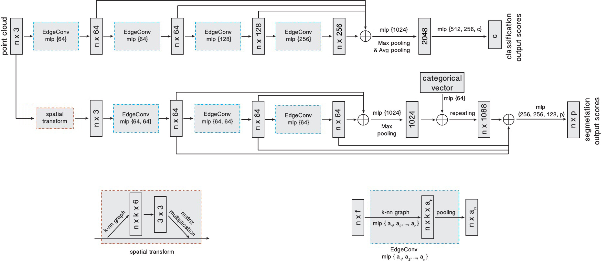

# DGCNN.pytorch
This repo is a PyTorch implementation for **Dynamic Graph CNN for Learning on Point Clouds (DGCNN)**(https://arxiv.xilesou.top/pdf/1801.07829). Our code skeleton is borrowed from [WangYueFt/dgcnn](https://github.com/WangYueFt/dgcnn/tree/master/pytorch).

Note that the drawed network sturcture for classification in DGCNN paper is not consistent with the corresponding description in section 4.1. We fixed this mistake using PS and present the revised figure below.

&nbsp;
<p float="left">
    
</p>

&nbsp;

**Tip:** The result of point cloud experiment usually faces greater randomness than 2D image. We suggest you run your experiement more than one time and select the best result.

&nbsp;
## Requirements
- Python 3.7
- PyTorch 1.2
- CUDA 10.0
- Package: glob, h5py, sklearn

&nbsp;
## Contents
- [Point Cloud Classification](#point-cloud-classification)
- [Point Cloud Part Segmentation](#point-cloud-part-segmentation)
- [Point Cloud Sementic Segmentation](#point-cloud-sementic-segmentation)

&nbsp;
## Point Cloud Classification
### Run the training script:

- 1024 points

``` 
python main_cls.py --exp_name=cls_1024 --num_points=1024 --k=20 
```

- 2048 points

``` 
python main_cls.py --exp_name=cls_2048 --num_points=2048 --k=40 
```

### Run the evaluation script after training finished:

- 1024 points

``` 
python main_cls.py --exp_name=cls_1024_eval --num_points=1024 --k=20 --eval=True --model_path=checkpoints/cls_1024/models/model.t7
```

- 2048 points

``` 
python main_cls.py --exp_name=cls_2048_eval --num_points=2048 --k=40 --eval=True --model_path=checkpoints/cls_2048/models/model.t7
```

### Run the evaluation script with pretrained models:

- 1024 points

``` 
python main_cls.py --exp_name=cls_1024_eval --num_points=1024 --k=20 --eval=True --model_path=pretrained/model.cls.1024.t7
```

- 2048 points

``` 
python main_cls.py --exp_name=cls_2048_eval --num_points=2048 --k=40 --eval=True --model_path=pretrained/model.cls.2048.t7
```

### Performance:
ModelNet40 dataset

|  | Mean Class Acc | Overall Acc | 
| :---: | :---: | :---: | 
| Paper (1024 points) | 90.2 | 92.9 |
| This repo (1024 points) | **90.9** | **93.3** |
| Paper (2048 points) | 90.7 | 93.5 |
| This repo (2048 points) | **91.2** | **93.6** |

&nbsp;
## Point Cloud Part Segmentation
### Run the training script:

- Full dataset

``` 
python main_partseg.py --exp_name=partseg 
```

- With class choice, for example airplane 

``` 
python main_partseg.py --exp_name=partseg_airplane --class_choice=airplane
```

### Run the evaluation script after training finished:

- Full dataset

``` 
python main_partseg.py --exp_name=partseg_eval --eval=True --model_path=checkpoints/partseg/models/model.t7
```

- With class choice, for example airplane 

``` 
python main_partseg.py --exp_name=partseg_airplane_eval --class_choice=airplane --eval=True --model_path=checkpoints/partseg_airplane/models/model.t7
```

### Run the evaluation script with pretrained models:

- Full dataset

``` 
python main_partseg.py --exp_name=partseg_eval --eval=True --model_path=pretrained/model.partseg.t7
```

- With class choice, for example airplane 

``` 
python main_partseg.py --exp_name=partseg_airplane_eval --class_choice=airplane --eval=True --model_path=pretrained/model.partseg.airplane.t7
```

### Performance:
ShapeNet part dataset

| | Mean IoU | Airplane | Bag | Cap | Car | Chair | Earphone | Guitar | Knife | Lamp | Laptop | Motor | Mug | Pistol | Rocket | Skateboard | Table
| :---: | :---: | :---: | :---: | :---: | :---: | :---: | :---: | :---: | :---: | :---: | :---: | :---: | :---: | :---: | :---: | :---: | :---: | 
| Shapes | | 2690 | 76 | 55 | 898 | 3758 | 69 | 787 | 392 | 1547 | 451 | 202 | 184 | 283 | 66 | 152 | 5271 | 
| Paper | **85.2** | 84.0 | **83.4** | **86.7** | 77.8 | 90.6 | 74.7 | 91.2 | **87.5** | 82.8 | **95.7** | 66.3 | **94.9** | 81.1 | **63.5** | 74.5 | 82.6 |
| This repo | **85.2** | **84.5** | 80.3 | 84.7 | **79.8** | **91.1** | **76.8** | **92.0** | 87.3 | **83.8** | **95.7** | **69.6** | 94.3 | **83.7** | 51.5 | **76.1** | **82.8** |

&nbsp;
## Point Cloud Sementic Segmentation

The network structure for this task is slightly different with part sementation, without spatial transform and categorical vector. The MLP in the end is changed into (512, 256, 13) and only one dropout is used after 256. 

You have to download `Stanford3dDataset_v1.2_Aligned_Version.zip` manually from https://goo.gl/forms/4SoGp4KtH1jfRqEj2 and place it under `data/`

### Run the training script:

This task use 6-fold training, such that 6 models are trained leaving 1 of 6 areas as the testing area for each model. 

- Train in area 1-5

``` 
python main_semseg.py --exp_name=semseg --test_area=6 
```

### Run the evaluation script after training finished:

- Evaluate in area 6

``` 
python main_semseg.py --exp_name=semseg_eval_6 --test_area=6 --eval=True --model_root=checkpoints/semseg/models/
```

- Evaluate in all area

``` 
python main_semseg.py --exp_name=semseg_eval --test_area=all --eval=True --model_root=checkpoints/semseg/models/
```

### Run the evaluation script with pretrained models:

- Evaluate in area 6

``` 
python main_semseg.py --exp_name=semseg_eval_6 --test_area=6 --eval=True --model_root=pretrained/semseg/
```

- Evaluate in all area

``` 
python main_semseg.py --exp_name=semseg_eval --test_area=all --eval=True --model_root=pretrained/semseg/
```

### Performance:
Stanford Large-Scale 3D Indoor Spaces Dataset (S3DIS) dataset

|  | Mean IoU | Overall Acc | 
| :---: | :---: | :---: | 
| Paper | 56.1 | 84.1 |
| This repo | **59.2** | **85.0** |
