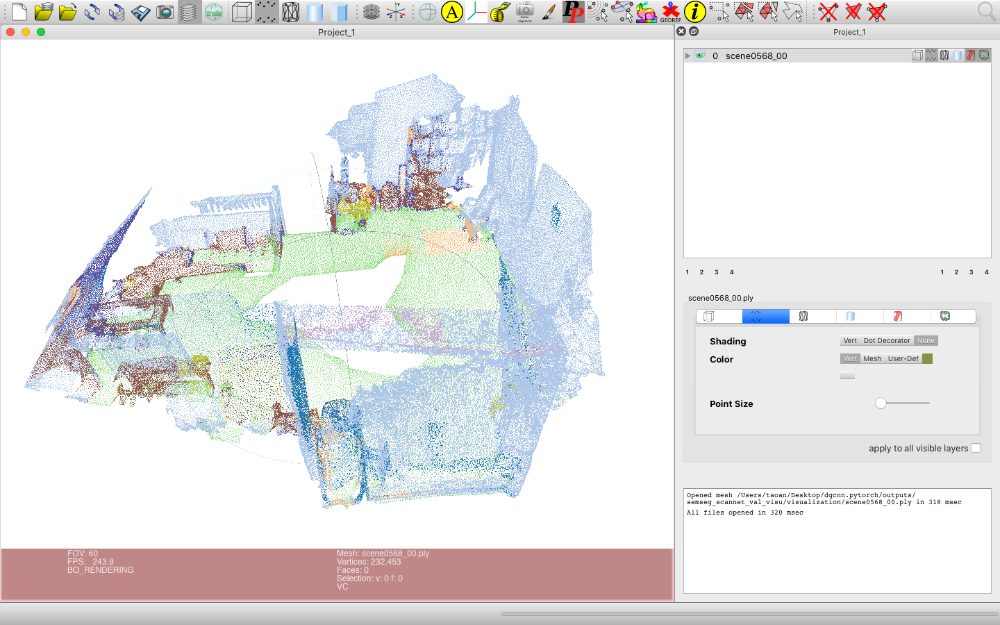
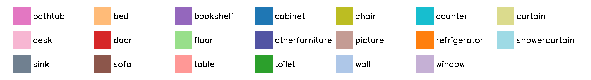

# DGCNN.pytorch
[[中文版]](README_zh.md)

This repo is a PyTorch implementation for **Dynamic Graph CNN for Learning on Point Clouds (DGCNN)**(https://arxiv.org/pdf/1801.07829). Our code skeleton is borrowed from [WangYueFt/dgcnn](https://github.com/WangYueFt/dgcnn/tree/master/pytorch).

**Updates:** 

- [2022/10/22] Add semantic segmentation on the ScanNet dataset by [Ziyi Wu](https://wuziyi616.github.io/) (dazitu616@gmail.com) and [Yingqi Wang](https://github.com/HilbertWang2002) (yingqi-w19@mails.tsinghua.edu.cn).
- [2021/07/20] Add visualization code for part segmentation and semantic segmentation by [Pengliang Ji](https://github.com/Ji-Pengliang) (jpl1723@buaa.edu.cn).

The network structure (Fig. 3) for classification in DGCNN paper is not consistent with the corresponding description in section 4.1 of the paper. The author of DGCNN adopts the setting of classification network in section 4.1, not Fig. 3. We fixed this mistake in Fig. 3 using PS and present the revised figure below.

&nbsp;
<p float="left">
    
</p>

&nbsp;

**Tip:** The result of point cloud experiment usually faces greater randomness than 2D image. We suggest you run your experiment more than one time and select the best result.

&nbsp;
## Requirements
- Python >= 3.7
- PyTorch >= 1.2
- CUDA >= 10.0
- Package: glob, h5py, sklearn, plyfile, torch_scatter

&nbsp;
## Contents
- [Point Cloud Classification](#point-cloud-classification)
- [Point Cloud Part Segmentation](#point-cloud-part-segmentation)
- [Point Cloud Semantic Segmentation on the S3DIS Dataset](#point-cloud-semantic-segmentation-on-the-s3dis-dataset)
- [Point Cloud Semantic Segmentation on the ScanNet Dataset](#point-cloud-semantic-segmentation-on-the-scannet-dataset)

**Note:** All following commands default use all GPU cards. To specify the cards to use, add `CUDA_VISIBLE_DEVICES=0,1,2,3` before each command, where the user uses 4 GPU cards with card index `0,1,2,3`. You can change the card number and indexes depending on your own needs.

&nbsp;
## Point Cloud Classification
### Run the training script:

- 1024 points

``` 
python main_cls.py --exp_name=cls_1024 --num_points=1024 --k=20 
```

- 2048 points

``` 
python main_cls.py --exp_name=cls_2048 --num_points=2048 --k=40 
```

### Run the evaluation script after training finished:

- 1024 points

``` 
python main_cls.py --exp_name=cls_1024_eval --num_points=1024 --k=20 --eval=True --model_path=outputs/cls_1024/models/model.t7
```

- 2048 points

``` 
python main_cls.py --exp_name=cls_2048_eval --num_points=2048 --k=40 --eval=True --model_path=outputs/cls_2048/models/model.t7
```

### Run the evaluation script with pretrained models:

- 1024 points

``` 
python main_cls.py --exp_name=cls_1024_eval --num_points=1024 --k=20 --eval=True --model_path=pretrained/model.cls.1024.t7
```

- 2048 points

``` 
python main_cls.py --exp_name=cls_2048_eval --num_points=2048 --k=40 --eval=True --model_path=pretrained/model.cls.2048.t7
```

### Performance:
ModelNet40 dataset

|  | Mean Class Acc | Overall Acc |
| :---: | :---: | :---: |
| Paper (1024 points) | 90.2 | 92.9 |
| This repo (1024 points) | **90.9** | **93.3** |
| Paper (2048 points) | 90.7 | 93.5 |
| This repo (2048 points) | **91.2** | **93.6** |

&nbsp;
## Point Cloud Part Segmentation
**Note:** The training modes **'full dataset'** and **'with class choice'** are different. 

- In **'full dataset'**, the model is trained and evaluated in all 16 classes and outputs mIoU 85.2% in this repo. The prediction of points in each shape can be any part of all 16 classes.
- In **'with class choice'**, the model is trained and evaluated in one class, for example airplane, and outputs mIoU 84.5% for airplane in this repo. The prediction of points in each shape can only be one of the parts in this chosen class.

### Run the training script:

- Full dataset

``` 
python main_partseg.py --exp_name=partseg 
```

- With class choice, for example airplane 

``` 
python main_partseg.py --exp_name=partseg_airplane --class_choice=airplane
```

### Run the evaluation script after training finished:

- Full dataset

```
python main_partseg.py --exp_name=partseg_eval --eval=True --model_path=outputs/partseg/models/model.t7
```

- With class choice, for example airplane 

```
python main_partseg.py --exp_name=partseg_airplane_eval --class_choice=airplane --eval=True --model_path=outputs/partseg_airplane/models/model.t7
```

### Run the evaluation script with pretrained models:

- Full dataset

``` 
python main_partseg.py --exp_name=partseg_eval --eval=True --model_path=pretrained/model.partseg.t7
```

- With class choice, for example airplane 

``` 
python main_partseg.py --exp_name=partseg_airplane_eval --class_choice=airplane --eval=True --model_path=pretrained/model.partseg.airplane.t7
```

### Performance:

ShapeNet part dataset

| | Mean IoU | Airplane | Bag | Cap | Car | Chair | Earphone | Guitar | Knife | Lamp | Laptop | Motor | Mug | Pistol | Rocket | Skateboard | Table
| :---: | :---: | :---: | :---: | :---: | :---: | :---: | :---: | :---: | :---: | :---: | :---: | :---: | :---: | :---: | :---: | :---: | :---: | 
| Shapes | | 2690 | 76 | 55 | 898 | 3758 | 69 | 787 | 392 | 1547 | 451 | 202 | 184 | 283 | 66 | 152 | 5271 | 
| Paper | **85.2** | 84.0 | **83.4** | **86.7** | 77.8 | 90.6 | 74.7 | 91.2 | **87.5** | 82.8 | **95.7** | 66.3 | **94.9** | 81.1 | **63.5** | 74.5 | 82.6 |
| This repo | **85.2** | **84.5** | 80.3 | 84.7 | **79.8** | **91.1** | **76.8** | **92.0** | 87.3 | **83.8** | **95.7** | **69.6** | 94.3 | **83.7** | 51.5 | **76.1** | **82.8** |

### Visualization:
#### Usage:

Use `--visu` to control visualization file. 

- To visualize a single shape, for example the 0-th airplane (the shape index starts from 0), use `--visu=airplane_0`. 
- To visualize all shapes in a class, for example airplane, use `--visu=airplane`. 
- To visualize all shapes in all classes, use `--visu=all`. 

Use `--visu_format` to control visualization file format. 

- To output .txt file, use `--visu_format=txt`. 
- To output .ply format, use `--visu_format=ply`. 

Both .txt and .ply file can be loaded into [MeshLab](https://www.meshlab.net) for visualization. For the usage of MeshLab on .txt file, see issue [#8](https://github.com/AnTao97/dgcnn.pytorch/issues/8) for details. The .ply file can be directly loaded into MeshLab by dragging.

The visualization file name follows the format `shapename_pred_miou.FILE_TYPE` for prediction output or `shapename_gt.FILE_TYPE` for ground-truth, where `miou` shows the mIoU prediction for this shape.

#### Full dataset:

- Output the visualization file of the 0-th airplane with .ply format

```
# Use trained model
python main_partseg.py --exp_name=partseg_eval --eval=True --model_path=outputs/partseg/models/model.t7 --visu=airplane_0 --visu_format=ply

# Use pretrained model
python main_partseg.py --exp_name=partseg_eval --eval=True --model_path=pretrained/model.partseg.t7 --visu=airplane_0 --visu_format=ply
```

- Output the visualization files of all shapes in airplane class with .ply format

```
# Use trained model
python main_partseg.py --exp_name=partseg_eval --eval=True --model_path=outputs/partseg/models/model.t7 --visu=airplane --visu_format=ply

# Use pretrained model
python main_partseg.py --exp_name=partseg_eval --eval=True --model_path=pretrained/model.partseg.t7 --visu=airplane --visu_format=ply
```

- Output the visualization files of all shapes in all classes with .ply format

```
# Use trained model
python main_partseg.py --exp_name=partseg_eval --eval=True --model_path=outputs/partseg/models/model.t7 --visu=all --visu_format=ply

# Use pretrained model
python main_partseg.py --exp_name=partseg_eval --eval=True --model_path=pretrained/model.partseg.t7 --visu=all --visu_format=ply
```

#### With class choice, for example airplane:

- Output the visualization file of the 0-th airplane with .ply format

```
# Use trained model
python main_partseg.py --exp_name=partseg_airplane_eval --class_choice=airplane --eval=True --model_path=outputs/partseg_airplane/models/model.t7 --visu=airplane_0 --visu_format=ply

# Use pretrained model
python main_partseg.py --exp_name=partseg_airplane_eval --class_choice=airplane --eval=True --model_path=pretrained/model.partseg.airplane.t7 --visu=airplane_0 --visu_format=ply
```

- Output the visualization files of all shapes in airplane class with .ply format

```
# Use trained model
python main_partseg.py --exp_name=partseg_airplane_eval --class_choice=airplane --eval=True --model_path=outputs/partseg_airplane/models/model.t7 --visu=airplane --visu_format=ply

# Use pretrained model
python main_partseg.py --exp_name=partseg_airplane_eval --class_choice=airplane --eval=True --model_path=pretrained/model.partseg.airplane.t7 --visu=airplane --visu_format=ply
```

#### Results:
The visualization result of the airplane 0:

<p float="left">
    
</p>

Color map:
<p float="left">
    
</p>

&nbsp;
## Point Cloud Semantic Segmentation on the S3DIS Dataset

The network structure for this task is slightly different with part segmentation, without spatial transform and categorical vector. The MLP in the end is changed into (512, 256, 13) and only one dropout is used after 256. 

You have to download `Stanford3dDataset_v1.2_Aligned_Version.zip` manually from https://goo.gl/forms/4SoGp4KtH1jfRqEj2 and place it under `data/`

### Run the training script:

This task uses 6-fold training, such that 6 models are trained leaving 1 of 6 areas as the testing area for each model. 

- Train in area 1-5

``` 
python main_semseg_s3dis.py --exp_name=semseg_s3dis_6 --test_area=6 
```

### Run the evaluation script after training finished:

- Evaluate in area 6 after the model is trained in area 1-5

``` 
python main_semseg_s3dis.py --exp_name=semseg_s3dis_eval_6 --test_area=6 --eval=True --model_root=outputs/semseg_s3dis/models/
```

- Evaluate in all areas after 6 models are trained

``` 
python main_semseg_s3dis.py --exp_name=semseg_s3dis_eval --test_area=all --eval=True --model_root=outputs/semseg_s3dis/models/
```

### Run the evaluation script with pretrained models:

- Evaluate in area 6

``` 
python main_semseg_s3dis.py --exp_name=semseg_s3dis_eval_6 --test_area=6 --eval=True --model_root=pretrained/semseg_s3dis/
```

- Evaluate in all areas

``` 
python main_semseg_s3dis.py --exp_name=semseg_s3dis_eval --test_area=all --eval=True --model_root=pretrained/semseg_s3dis/
```

### Performance:

Stanford Large-Scale 3D Indoor Spaces Dataset (S3DIS) dataset

|  | Mean IoU | Overall Acc |
| :---: | :---: | :---: |
| Paper | 56.1 | 84.1 |
| This repo | **59.2** | **85.0** |

### Visualization: 
#### Usage:

Use `--visu` to control visualization file. 

- To visualize a single room, for example the office room 1 in area 6 (the room index starts from 1), use `--visu=area_6_office_1`. 
- To visualize all rooms in an area, for example area 6, use `--visu=area_6`. 
- To visualize all rooms in all areas, use `--visu=all`. 

Use `--visu_format` to control visualization file format. 

- To output .txt file, use `--visu_format=txt`. 
- To output .ply format, use `--visu_format=ply`. 

Both .txt and .ply file can be loaded into [MeshLab](https://www.meshlab.net) for visualization. For the usage of MeshLab on .txt file, see issue [#8](https://github.com/AnTao97/dgcnn.pytorch/issues/8) for details. The .ply file can be directly loaded into MeshLab by dragging.

The visualization file name follows the format `roomname_pred_<miou>.FILE_TYPE` for prediction output or `roomname_gt.FILE_TYPE` for ground-truth, where `<miou>` shows the mIoU prediction for this room.

**Note:** In semantic segmentation, you need to first run a training or evaluation command without visualization in the above sections to preprocess dataset. With the dataset well prepared, you can run a command with visualization in the following sections. 

#### Evaluate in area 6 after the model is trained in area 1-5:

- Output the visualization file of office room 1 in area 6 with .ply format

```
# Use trained model
python main_semseg_s3dis.py --exp_name=semseg_s3dis_eval_6 --test_area=6 --eval=True --model_root=outputs/semseg_s3dis/models/ --visu=area_6_office_1 --visu_format=ply

# Use pretrained model
python main_semseg_s3dis.py --exp_name=semseg_s3dis_eval_6 --test_area=6 --eval=True --model_root=pretrained/semseg_s3dis/ --visu=area_6_office_1 --visu_format=ply
```

- Output the visualization files of all rooms in area 6 with .ply format

```
# Use trained model
python main_semseg_s3dis.py --exp_name=semseg_s3dis_eval_6 --test_area=6 --eval=True --model_root=outputs/semseg_s3dis/models/ --visu=area_6 --visu_format=ply

# Use pretrained model
python main_semseg_s3dis.py --exp_name=semseg_s3dis_eval_6 --test_area=6 --eval=True --model_root=pretrained/semseg_s3dis/ --visu=area_6 --visu_format=ply
```

#### Evaluate in all areas after 6 models are trained:

- Output the visualization file of office room 1 in area 6 with .ply format


```
# Use trained model
python main_semseg_s3dis.py --exp_name=semseg_s3dis_eval --test_area=all --eval=True --model_root=outputs/semseg_s3dis/models/ --visu=area_6_office_1 --visu_format=ply

# Use pretrained model
python main_semseg_s3dis.py --exp_name=semseg_s3dis_eval --test_area=all --eval=True --model_root=pretrained/semseg_s3dis/ --visu=area_6_office_1 --visu_format=ply
```

- Output the visualization files of all rooms in area 6 with .ply format

```
# Use trained model
python main_semseg_s3dis.py --exp_name=semseg_s3dis_eval --test_area=all --eval=True --model_root=outputs/semseg_s3dis/models/ --visu=area_6 --visu_format=ply

# Use pretrained model
python main_semseg_s3dis.py --exp_name=semseg_s3dis_eval --test_area=all --eval=True --model_root=pretrained/semseg_s3dis/ --visu=area_6 --visu_format=ply
```

- Output the visualization files of all rooms in all areas with .ply format

```
# Use trained model
python main_semseg_s3dis.py --exp_name=semseg_s3dis_eval --test_area=all --eval=True --model_root=outputs/semseg_s3dis/models/ --visu=all --visu_format=ply

# Use pretrained model
python main_semseg_s3dis.py --exp_name=semseg_s3dis_eval --test_area=all --eval=True --model_root=pretrained/semseg_s3dis/ --visu=all --visu_format=ply
```

#### Results:
The visualization result of the office room 1 in area 6:

<p float="left">
    
</p>

Color map:
<p float="left">
    
</p>

&nbsp;
## Point Cloud Semantic Segmentation on the ScanNet Dataset

The DGCNN authors do not test on the ScanNet dataset. We try our best to implement the DGCNN model on the dataset.

### Prepare dataset:

You need to change the directory to the `prepare_data/` folder.

```
cd prepare_data/
```

Please download original dataset from [website](http://www.scan-net.org/). You need to place the dataset under `data/ScanNet/`. The path `data/ScanNet` includes `data/ScanNet/scans/` and `data/ScanNet/scans_test/` folder.

To prepare the Scannet dataset for training and evaluation, run

```
python scannetv2_seg_dataset_rgb21c_pointid.py
```

This will generate three pickle files: `scannet_train_rgb21c_pointid.pickle`, `scannet_val_rgb21c_pointid.pickle`, and `scannet_test_rgb21c_pointid.pickle`. 

Return to the root directory:

```
cd ..
```

### Run the training script:

```
python main_semseg_scannet.py --exp_name=semseg_scannet
```

To train with both the training split and the validation split, use `--train_val=True`.

You can use [TensorBoard](https://tensorflow.google.cn/tensorboard) to view the training log under `outputs/semseg_scannet/logs/`.

### Run the evaluation script after training finished:

- Evaluate on the validation set

```
python main_semseg_scannet.py --eval=True --model_path=outputs/semseg_scannet/models/model_200.pth --exp_name=semseg_scannet_val --split=val
```

- Evaluate on the testing set

```
python main_semseg_scannet.py --eval=True --model_path=outputs/semseg_scannet/models/model_200.pth --exp_name=semseg_scannet_test --split=test
```

### Run the evaluation script with pretrained models:

- Evaluate on the validation set

```
python main_semseg_scannet.py --eval=True --model_path=pretrained/semseg_scannet/models/model_200.pth --exp_name=semseg_scannet_val --split=val
```

- Evaluate on the testing set

```
python main_semseg_scannet.py --eval=True --model_path=pretrained/semseg_scannet/models/model_200.pth --exp_name=semseg_scannet_test --split=test
```

Since there are no ground-truth labels on the testing set, this script will directly save prediction result. You need to upload your prediction results to the [website](https://kaldir.vc.in.tum.de/scannet_benchmark/semantic_label_3d) for evaluation.

### Performance:

The validation set of the ScanNet Dataset

|  | Mean IoU | wall | floor | cabinet | bed | chair | sofa | table | door | window | bookshelf | picture | counter | desk | curtain | refrigerator | shower curtain | toilet | sink | bathtub | otherfurniture | 
| :---: | :---: | :---: | :---: | :---: | :---: | :---: | :---: | :---: | :---: | :---: | :---: | :---: | :---: | :---: | :---: | :---: | :---: | :---: | :---: | :---: | :---: | 
| This repo | 49.6 | 73.2 | 93.6 | 44.9 | 64.7 | 70.0 | 50.5 | 55.7 | 35.7 | 47.7 | 69.1 | 14.6 | 41.8 | 45.3 | 33.8 | 29.2 | 35.7 | 55.9 | 40.2 | 56.5 | 32.9 | 

The testing set of the ScanNet Dataset

|  | Mean IoU | wall | floor | cabinet | bed | chair | sofa | table | door | window | bookshelf | picture | counter | desk | curtain | refrigerator | shower curtain | toilet | sink | bathtub | other furniture | 
| :---: | :---: | :---: | :---: | :---: | :---: | :---: | :---: | :---: | :---: | :---: | :---: | :---: | :---: | :---: | :---: | :---: | :---: | :---: | :---: | :---: | :---: | 
| This repo | 44.6 | 72.3 | 93.7 | 36.6 | 62.3 | 65.1 | 57.7 | 44.5 | 33.0 | 39.4 | 46.3 | 12.6 | 31.0 | 34.9 | 38.9 | 28.5 | 22.4 | 62.5 | 35.0 | 47.4 | 27.1 | 

These is no official results of DGCNN on the ScanNet dataset. You can find our results on the [website](https://kaldir.vc.in.tum.de/scannet_benchmark/semantic_label_3d) as `DGCNN_reproduce`.

### Visualization:
#### Usage:

Use `--visu` to control visualization file.

- To visualization a single scene, for example `scene0568_00`, use `--visu=scene0568_00`.
- To visualization multiple scenes, please input these scenes separated by commas. e.g. `--visu=scene0568_00,scene0568_01`.
- To visualization the scenes of a split, use `--visu=train`, `--visu=val` or `--visu=test`.
- To visualization all the scenes in the dataset, use `--visu=all`.

Use `--visu_format` to control visualization file format. 

- To output .txt file, use `--visu_format=txt`. 
- To output .ply format, use `--visu_format=ply`.

Both .txt and .ply file can be loaded into [MeshLab](https://www.meshlab.net) for visualization. For the usage of MeshLab on .txt file, see issue [#8](https://github.com/AnTao97/dgcnn.pytorch/issues/8) for details. The .ply file can be directly loaded into MeshLab by dragging.

For example, if you want to visualize `scene0568_00` on the pretrained model, run:

```
python main_semseg_scannet.py --eval=True --model_path=pretrained/semseg_scannet/models/model_200.pth --exp_name=semseg_scannet_val_visu --visu=scene0568_00
```

#### Results:
The visualization result of `scene0568_00`:

<p float="left">
    
</p>

Color map:
<p float="left">
    
</p>