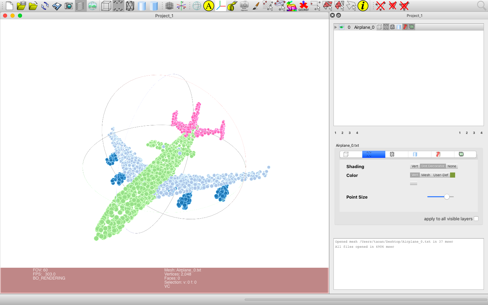

# DGCNN.pytorch
[[English]](README.md)

本仓库提供了一份PyTorch版本的 **Dynamic Graph CNN for Learning on Point Clouds (DGCNN)**（ https://arxiv.org/pdf/1801.07829 ）代码实现，代码框架来源于[WangYueFt/dgcnn](https://github.com/WangYueFt/dgcnn/tree/master/pytorch)。

**更新：** 

- [2021/7/20] 增加了可视化代码，作者：[纪鹏亮](https://github.com/Ji-Pengliang) (jpl1723@buaa.edu.cn).

在DGCNN文章中网络结构图（图3）中的分类网络和文章中对应的网络结构描述（第4.1节）并不吻合，原作者实际沿用了网络结构描述（第4.1节）中的网络结构，我们使用PS修复了网络结构图（图3）中不吻合的地方，修改后的图如下：

&nbsp;
<p float="left">
    
</p>

&nbsp;

**建议：** 3D点云实验结果往往比2D图像实验结果面临更大的随机性，因此我们建议您多跑几次实验，然后选择最佳的结果。

&nbsp;
## 运行需求
- Python 3.7
- PyTorch 1.2
- CUDA 10.0
- Python包：glob, h5py, sklearn, plyfile

&nbsp;
## 内容目录
- [点云分类](#_3)
- [点云局部分割](#_8)
- [点云场景语义分割](#_16)

**注意：** 以下所有命令默认使用所有显卡，如果需要明确使用几张显卡，比如4张显卡索引为`0,1,2,3`，那么在每个命令前需要添加`CUDA_VISIBLE_DEVICES=0,1,2,3`。你可以根据你的需要调整使用显卡的数量和索引。

&nbsp;
## 点云分类
### 运行训练脚本：

- 1024点

``` 
python main_cls.py --exp_name=cls_1024 --num_points=1024 --k=20 
```

- 2048点

``` 
python main_cls.py --exp_name=cls_2048 --num_points=2048 --k=40 
```

### 训练结束后运行评估脚本：

- 1024点

``` 
python main_cls.py --exp_name=cls_1024_eval --num_points=1024 --k=20 --eval=True --model_path=outputs/cls_1024/models/model.t7
```

- 2048点

``` 
python main_cls.py --exp_name=cls_2048_eval --num_points=2048 --k=40 --eval=True --model_path=outputs/cls_2048/models/model.t7
```

### 使用提供的已训练模型运行评估脚本：

- 1024点

``` 
python main_cls.py --exp_name=cls_1024_eval --num_points=1024 --k=20 --eval=True --model_path=pretrained/model.cls.1024.t7
```

- 2048点

``` 
python main_cls.py --exp_name=cls_2048_eval --num_points=2048 --k=40 --eval=True --model_path=pretrained/model.cls.2048.t7
```

### 模型性能：
ModelNet40数据集

|  | 平均类别Acc | 整体Acc | 
| :---: | :---: | :---: | 
| 原文章（1024点） | 90.2 | 92.9 |
| 本仓库（1024点） | **90.9** | **93.3** |
| 原文章（2048点） | 90.7 | 93.5 |
| 本仓库（2048点） | **91.2** | **93.6** |

&nbsp;
## 点云局部分割
**注意：** 训练模式中 **“全部类别”** 和 **“特定类别”** 有区别。 

- 在 **“全部类别”** 中，模型使用所有16个类别的数据进行训练和评估，并在这份代码中得出平均IoU为85.2%。每个点云形状中点的预测标签可以是16个类别中的任意一个局部类别。
- 在 **“特定类别”** 中，模型仅使用1个类别的数据进行训练和评估，比如飞机类别，并在这份代码中得出飞机类别的IoU为84.5%。每个点云形状中点的预测标签只能是这1个类别中的任意一个局部类别。

### 运行训练脚本：

- 使用数据集内全部类别

``` 
python main_partseg.py --exp_name=partseg 
```

- 选择数据集内特定类别，例如飞机

``` 
python main_partseg.py --exp_name=partseg_airplane --class_choice=airplane
```

### 训练结束后运行评估脚本：

- 使用数据集内全部类别

``` 
python main_partseg.py --exp_name=partseg_eval --eval=True --model_path=outputs/partseg/models/model.t7
```

- 选择数据集内特定类别，例如飞机

``` 
python main_partseg.py --exp_name=partseg_airplane_eval --class_choice=airplane --eval=True --model_path=outputs/partseg_airplane/models/model.t7
```

### 使用提供的已训练模型运行评估脚本：

- 使用数据集内全部类别

``` 
python main_partseg.py --exp_name=partseg_eval --eval=True --model_path=pretrained/model.partseg.t7
```

- 选择数据集内特定类别，例如飞机

``` 
python main_partseg.py --exp_name=partseg_airplane_eval --class_choice=airplane --eval=True --model_path=pretrained/model.partseg.airplane.t7
```

### 模型性能
ShapeNet part 数据集

| &emsp;&emsp;&emsp;&emsp; | 平均IoU | 飞机 | 包 | 帽子 | 车 | 椅子 | 耳机 | 吉他 | 刀 | 灯 | 笔记本电脑 | 摩托车 | 杯子 | 手枪 | 火箭 | 滑板 | 桌子 | 
| :---: | :---: | :---: | :---: | :---: | :---: | :---: | :---: | :---: | :---: | :---: | :---: | :---: | :---: | :---: | :---: | :---: | :---: | 
| &emsp;&emsp;&emsp;&emsp; | mIoU | airplane | bag | cap | car | chair | earphone | guitar | knife | lamp | laptop | motor | mug | pistol | rocket | skateboard | table | 
| 形状数量 | &emsp;&emsp;&emsp;&emsp; | 2690 | 76 | 55 | 898 | 3758 | 69 | 787 | 392 | 1547 | 451 | 202 | 184 | 283 | 66 | 152 | 5271 | 
| 原文章 | **85.2** | 84.0 | **83.4** | **86.7** | 77.8 | 90.6 | 74.7 | 91.2 | **87.5** | 82.8 | **95.7** | 66.3 | **94.9** | 81.1 | **63.5** | 74.5 | 82.6 |
| 本仓库 | **85.2** | **84.5** | 80.3 | 84.7 | **79.8** | **91.1** | **76.8** | **92.0** | 87.3 | **83.8** | **95.7** | **69.6** | 94.3 | **83.7** | 51.5 | **76.1** | **82.8** |

### 可视化：
#### 使用说明：

使用`--visu`控制需要可视化的文件。

- 对于可视化一个点云形状，比如类别飞机索引为0的点云形状（点云形状的索引为从0开始），使用`--visu=airplane_0`。
- 对于可视化一个类别中的所有点云形状，比如飞机类别，使用`--visu=airplane`。
- 对于可视化所有类别的所有点云类别，使用`--visu=all`。

使用`--visu_format`控制可视化文件的格式。

- 输出.txt格式，使用`--visu_format=txt`。
- 输出.ply格式，使用`--visu_format=ply`。 

所有格式均可通过[MeshLab](https://www.meshlab.net)来加载进行可视化。对于使用MeshLab可视化.txt格式，参考问题[#8](https://github.com/AnTao97/dgcnn.pytorch/issues/8)中的介绍，而.ply格式可以直接拖入MeshLab进行可视化。

可视化文件名遵循统一的命名格式。对于预测结果，文件名格式为`点云形状名称_pred_miou.格式后缀`；对于真实标签，文件名格式为`点云形状名称_gt.格式后缀`。文件名中`miou`指该点云形状的平均IoU。

#### 全部类别：

- 输出飞机类别索引为0的点云形状的.ply格式可视化结果

```
# 使用训练后的模型
python main_partseg.py --exp_name=partseg_eval --eval=True --model_path=outputs/partseg/models/model.t7 --visu=airplane_0 --visu_format=ply

# 使用提供的已训练模型
python main_partseg.py --exp_name=partseg_eval --eval=True --model_path=pretrained/model.partseg.t7 --visu=airplane_0 --visu_format=ply
```

- 输出飞机类别的所有点云形状的.ply格式可视化结果

```
# 使用训练后的模型
python main_partseg.py --exp_name=partseg_eval --eval=True --model_path=outputs/partseg/models/model.t7 --visu=airplane --visu_format=ply

# 使用提供的已训练模型
python main_partseg.py --exp_name=partseg_eval --eval=True --model_path=pretrained/model.partseg.t7 --visu=airplane --visu_format=ply
```

- 输出所有类别的所有点云形状的.ply格式可视化结果

```
# 使用训练后的模型
python main_partseg.py --exp_name=partseg_eval --eval=True --model_path=outputs/partseg/models/model.t7 --visu=all --visu_format=ply

# 使用提供的已训练模型
python main_partseg.py --exp_name=partseg_eval --eval=True --model_path=pretrained/model.partseg.t7 --visu=all --visu_format=ply
```

#### 选择数据集内特定类别，例如飞机：

- 输出飞机类别索引为0的点云形状的.ply格式可视化结果

```
# 使用训练后的模型
python main_partseg.py --exp_name=partseg_airplane_eval --class_choice=airplane --eval=True --model_path=outputs/partseg_airplane/models/model.t7 --visu=airplane_0 --visu_format=ply

# 使用提供的已训练模型
python main_partseg.py --exp_name=partseg_airplane_eval --class_choice=airplane --eval=True --model_path=pretrained/model.partseg.airplane.t7 --visu=airplane_0 --visu_format=ply
```

- 输出飞机类别的所有点云形状的.ply格式可视化结果

```
# 使用训练后的模型
python main_partseg.py --exp_name=partseg_airplane_eval --class_choice=airplane --eval=True --model_path=outputs/partseg_airplane/models/model.t7 --visu=airplane --visu_format=ply

# 使用提供的已训练模型
python main_partseg.py --exp_name=partseg_airplane_eval --class_choice=airplane --eval=True --model_path=pretrained/model.partseg.airplane.t7 --visu=airplane --visu_format=ply
```

#### 可视化结果：
属于飞机类别索引为0的点云形状的可视化结果：

<p float="left">
    
</p>

颜色对应图：
<p float="left">
    
</p>

&nbsp;
## 点云场景语义分割

在此任务中网络结构和点云局部分割有细微不同，最后的一个MLP尺寸改为（512, 256, 13），而且在256后只使用一个dropout。

您必须从 https://goo.gl/forms/4SoGp4KtH1jfRqEj2 手动下载数据集`Stanford3dDataset_v1.2_Aligned_Version.zip`，然后将其放在`data/`目录下。

### 运行训练脚本：

此任务使用6折训练，因此需要训练6个模型，轮流选择数据集中6个区域中的1个作为这个模型的测试区域。

- 在区域1-5上训练

``` 
python main_semseg.py --exp_name=semseg_6 --test_area=6 
```

### 训练结束后运行评估脚本：

- 当模型在区域1-5训练完成后，在区域6中评估

``` 
python main_semseg.py --exp_name=semseg_eval_6 --test_area=6 --eval=True --model_root=outputs/semseg/models/
```

- 当6个模型训练完成后，在所有区域上评估

``` 
python main_semseg.py --exp_name=semseg_eval --test_area=all --eval=True --model_root=outputs/semseg/models/
```

### 使用提供的已训练模型运行评估脚本：

- 使用提供的在区域1-5上已训练模型，在区域6中评估

``` 
python main_semseg.py --exp_name=semseg_eval_6 --test_area=6 --eval=True --model_root=pretrained/semseg/
```

- 使用提供的6个已训练模型，在所有区域上评估

``` 
python main_semseg.py --exp_name=semseg_eval --test_area=all --eval=True --model_root=pretrained/semseg/
```

### 模型性能：
斯坦福大学大型3D室内空间数据集（S3DIS）

|  | 平均IoU | 整体Acc | 
| :---: | :---: | :---: | 
| 原文章 | 56.1 | 84.1 |
| 本仓库 | **59.2** | **85.0** |

### 可视化：
#### 使用说明：

使用`--visu`控制需要可视化的文件。

- 对于可视化一个房间，比如第区域6的办公室1（房间索引为从1开始），使用`--visu=area_6_office_1`。
- 对于可视化一个区域中所有的房间，比如区域6，使用`--visu=area_6`。
- 对于可视化所有区域的所有房间，使用`--visu=all`。

使用`--visu_format`控制可视化文件的格式。

- 输出.txt格式，使用`--visu_format=txt`。
- 输出.ply格式，使用`--visu_format=ply`。 

所有格式均可通过[MeshLab](https://www.meshlab.net)来加载进行可视化。对于使用MeshLab可视化.txt格式，参考问题[#8](https://github.com/AnTao97/dgcnn.pytorch/issues/8)中的介绍，而.ply格式可以直接拖入MeshLab进行可视化。

可视化文件名遵循统一的命名格式。对于预测结果，文件名格式为`房间名称_pred_miou.格式后缀`；对于真实标签，文件名格式为`房间名称_gt.格式后缀`。文件名中`miou`指该房间的平均IoU。

**注意：**对于语义分割，需要首先运行一个不带可视化的命令来预处理数据集，比如可视化部分之前的训练命令和评估命令。在数据集处理完成后，可以运行下面带有可视化的命令。

#### 当模型在区域1-5训练完成后，在区域6中评估：

- 输出区域6的办公室1的.ply格式可视化结果

```
# 使用训练后的模型
python main_semseg.py --exp_name=semseg_eval_6 --test_area=6 --eval=True --model_root=outputs/semseg/models/ --visu=area_6_office_1 --visu_format=ply

# 使用提供的已训练模型
python main_semseg.py --exp_name=semseg_eval_6 --test_area=6 --eval=True --model_root=pretrained/semseg/ --visu=area_6_office_1 --visu_format=ply
```

- 输出区域6的所有房间的.ply格式可视化结果

```
# 使用训练后的模型
python main_semseg.py --exp_name=semseg_eval_6 --test_area=6 --eval=True --model_root=outputs/semseg/models/ --visu=area_6 --visu_format=ply

# 使用提供的已训练模型
python main_semseg.py --exp_name=semseg_eval_6 --test_area=6 --eval=True --model_root=pretrained/semseg/ --visu=area_6 --visu_format=ply
```

#### 当6个模型训练完成后，在所有区域上评估：

- 输出区域6的办公室1的.ply格式可视化结果


```
# 使用训练后的模型
python main_semseg.py --exp_name=semseg_eval --test_area=all --eval=True --model_root=outputs/semseg/models/ --visu=area_6_office_1 --visu_format=ply

# 使用提供的已训练模型
python main_semseg.py --exp_name=semseg_eval --test_area=all --eval=True --model_root=pretrained/semseg/ --visu=area_6_office_1 --visu_format=ply
```

- 输出区域6的所有房间的.ply格式可视化结果

```
# 使用训练后的模型
python main_semseg.py --exp_name=semseg_eval --test_area=all --eval=True --model_root=outputs/semseg/models/ --visu=area_6 --visu_format=ply

# 使用提供的已训练模型
python main_semseg.py --exp_name=semseg_eval --test_area=all --eval=True --model_root=pretrained/semseg/ --visu=area_6 --visu_format=ply
```

- 输出所有区域的所有房间的.ply格式可视化结果

```
# 使用训练后的模型
python main_semseg.py --exp_name=semseg_eval --test_area=all --eval=True --model_root=outputs/semseg/models/ --visu=all --visu_format=ply

# 使用提供的已训练模型
python main_semseg.py --exp_name=semseg_eval --test_area=all --eval=True --model_root=pretrained/semseg/ --visu=all --visu_format=ply
```

#### 可视化结果：
区域6的办公室1的可视化结果：

<p float="left">
    
</p>

颜色对应图：
<p float="left">
    
</p>
